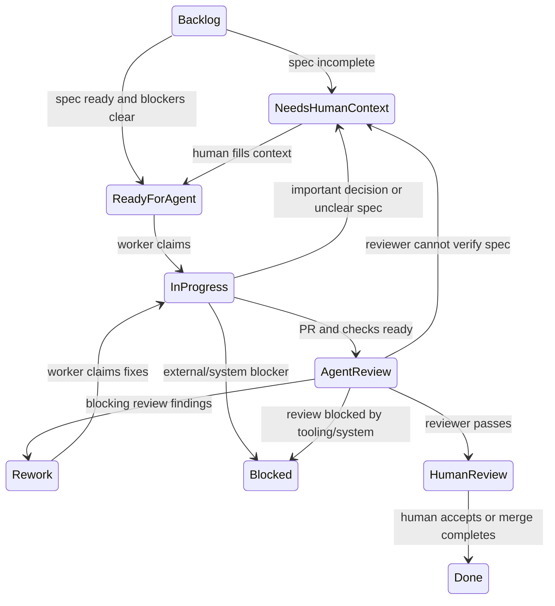

# Agent Issue Tracker

This repo uses Linear as the private operating queue for agentic work and
GitHub issues as the durable public implementation spec when public review or
long-term traceability is needed.

## Linear States

Use these states for the agent build workflow:

- `Backlog`: parked work, design notes, or DAG nodes that are not ready for an
  agent.
- `Needs Human Context`: the issue lacks enough context, acceptance criteria,
  dependency state, or decision authority for an agent to proceed safely.
- `Ready for Agent`: the only normal state a worker Symphony instance should
  poll for new implementation work.
- `In Progress`: a worker has claimed the issue and is implementing or
  validating it.
- `Agent Review`: worker handoff queue. The PR, required checks, latest
  `## Codex Worker Note`, and evidence must be ready before a worker moves an
  issue here.
- `Rework`: reviewer found blocking findings. The worker should address only
  the recorded findings and return through `Agent Review`.
- `Human Review`: reviewer passed the issue and human review, merge, or final
  acceptance is needed.
- `Blocked`: a tool, credential, environment, dependency, CI, deployment, or
  system condition prevents progress. This is not for missing product context.
- `Done`: terminal success.
- `Canceled`, `Cancelled`, `Duplicate`: terminal non-success outcomes.

## State Machine



## Symphony Routing

Run separate Symphony instances for worker and reviewer roles.

Worker workflow:

```yaml
tracker:
  dispatch_states:
    - Ready for Agent
    - Rework
  active_states:
    - Ready for Agent
    - In Progress
    - Rework
  terminal_states:
    - Agent Review
    - Human Review
    - Needs Human Context
    - Blocked
    - Done
    - Canceled
    - Cancelled
    - Duplicate
```

Reviewer workflow:

```yaml
tracker:
  dispatch_states:
    - Agent Review
  active_states:
    - Agent Review
  terminal_states:
    - Rework
    - Human Review
    - Needs Human Context
    - Blocked
    - Done
    - Canceled
    - Cancelled
    - Duplicate
```

The worker should move `Ready for Agent` or `Rework` issues to `In Progress`
before editing. The reviewer should not edit product code.

## Agent Notes

Use append-only human-facing comments as the issue's version ledger:

- Worker round N creates one new comment whose first line is
  `## Codex Worker Note` and includes `Round: N`.
- Reviewer round N creates one new comment whose first line is
  `## Codex Review Note` and includes `Round: N`.
- Rework creates the next worker round and the next review round. Prior notes
  are not edited or overwritten.
- Legacy `## Codex Workpad` comments remain readable historical context, but
  new automation should write worker/review notes instead.
- Runtime-owned `## Symphony Control` comments are not part of the human audit
  trail and should normally disappear after claim release.

## DAG Release

Use Linear blocking relations as the execution DAG. A DAG node is releasable
only when:

- all non-terminal blockers are resolved,
- the issue brief satisfies the readiness contract below,
- the work is worker-safe rather than manager-owned,
- dependencies that require deployment are merged and deployed, not merely
  coded.

Keep unreleased DAG nodes in `Backlog`. Move exactly the ready nodes to
`Ready for Agent`. Do not use `Todo` as an automation queue.

## Agent Brief Readiness

An issue can enter `Ready for Agent` only when it has enough information for a
worker and reviewer to judge success independently:

```markdown
## Agent Brief

**Category:** bug / enhancement / docs / chore
**Summary:** one-line description

## Current Behavior

## Desired Behavior

## What To Build

## Key Interfaces

## Acceptance Criteria

- [ ] Observable criterion

## Required Tests

## Required Evidence

## Dependencies

- Blocked by:
- Blocks:

## Decision Policy

- Agent may decide:
- Return to Needs Human Context when:

## Out Of Scope
```

If the brief is missing clear scope, acceptance criteria, testing intent,
dependency state, or decision policy, move the issue to `Needs Human Context`
instead of guessing.
